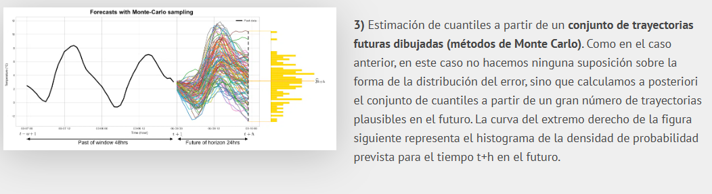

# LuxSenseProject

Sistema inteligente de automatización de iluminación y monitoreo de consumo energético para entornos laborales.

## 🚀 Descripción

LuxSense es una plataforma que permite gestionar el encendido y apagado de luces de manera automática mediante sensores de presencia. También proporciona un dashboard visual con reportes del consumo energético y hace prediccion de consumo energetico, usando como método (métodos de Monte Carlo).

Imagen para entender un poco más que es el (métodos de Monte Carlo).

 -> Imagen ctrl + cick para abrir. ❤

## 📂 Tecnologías utilizadas

- **Frontend:** React + TypeScript + Vite + TailwindCSS 
- **Backend:** Node.js (Express)
- **Base de Datos:** MongoDB
- **Seguridad:** JWT, Encriptación de contraseñas
- **Notificaciones:** Integración con SendGrid/AWS SES

## ⚙️ Instalación y uso

1. Clona el repositorio:
```bash


git clone https://github.com/zodiakoCEO/LuxSenseProject.git
